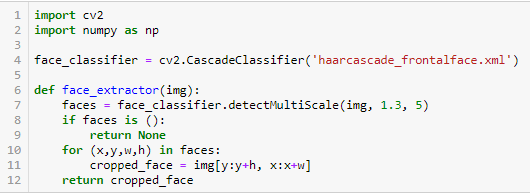
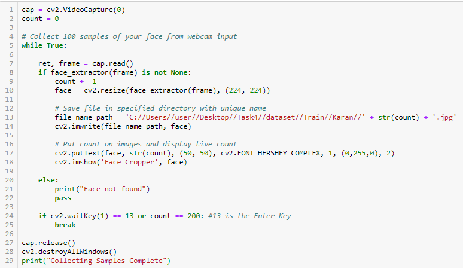
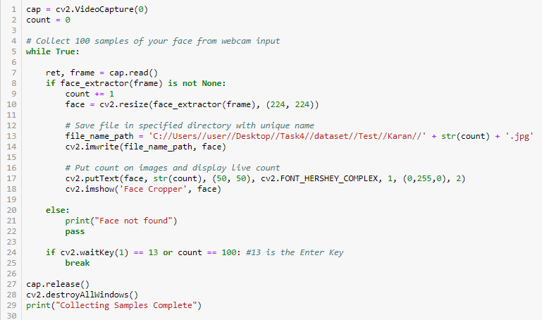
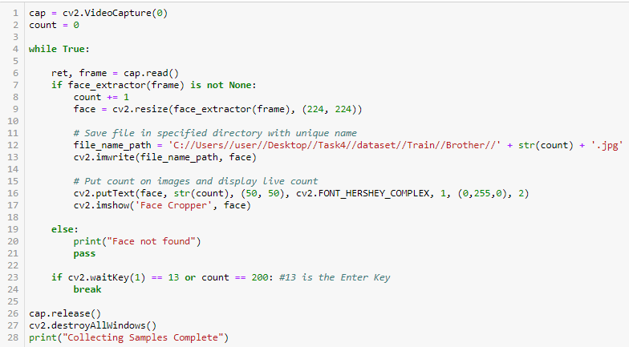
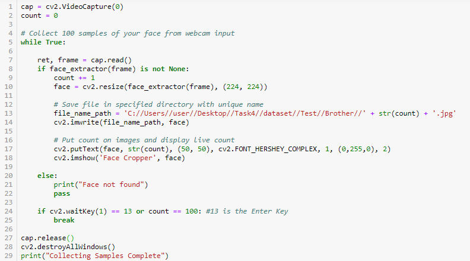
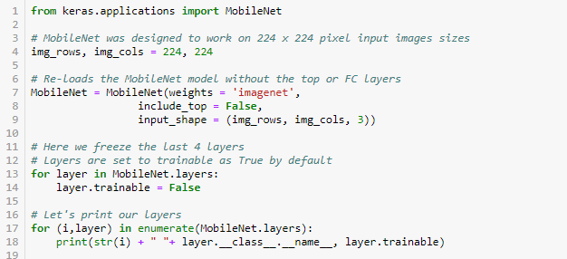
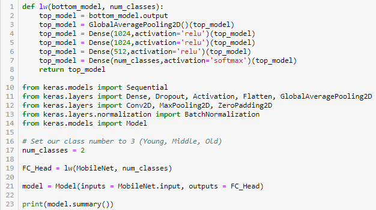
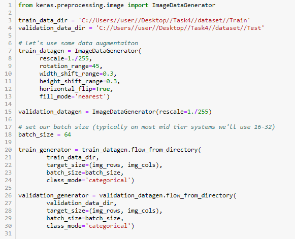
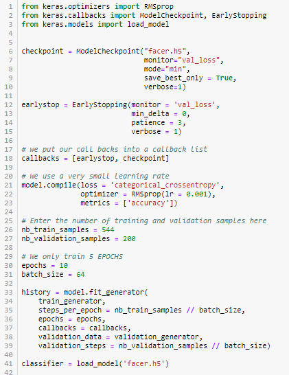

# **Task 4 Transfer Learning**
*Transfer learning make use of the knowledge gained while solving one problem and applying it to a different but related problem.*

*MobileNet is a CNN architecture model for Image Classification and Mobile Vision. MobileNets are small, low-latency, low-power models parameterized to meet the resource constraints of a variety of use cases. They can be built upon for classification, detection, embeddings and segmentation similar to how other popular large scale models, such as Inception, are used.* 

*We are going to use this model knowledge of image Classification to classify the image of me and my brother.*

**First Step**

*We are going to collect images in two set, 200 for training and 100 for testing. We initialise the library such as opencv (CV2) and numpy. We defined a function **face_extractor** which detect the face using **harcascade_frontalface** and crops it. If the face is not founf it will return **face not found** else it save the image in respective folder after cropped and increase the count.*

**Image of Importing library for image capturing and function definition**!

**For collecting image  for Training and Testing of Karan's image**

*As from the code the image we first click the image image using default webcam. As **read method** return the two value, first is status and other is photo which is captured and stored in the variable name frame. Later it checks whether the image is having a face or not, it the **face_extractor** return **None**, it pop-up output as **Face not Found**, otherwise the **face_extractor** return the cropped image.*

**For capturing image for training and testing of my Brother's Image** 

**MobileNet**
*To retrieve **model layer name only** we use :*
**model.layers[i].__class__.__name__**

*To check whether layer is trainale or not*
**model.layer[i].trainable**
*it it returns **True** we can retrain it*

*In case of Transfer-Learning we are not going to train whole model, we free all the layers using :*
**for layer in model.layers: [layers.trainable = False]**

**Adding layer in the same model**

**Image Augmentation**

*Image augmentation is a technique that is used to artificially expand the data-set. Image Augmentation parameters that are generally used to increase the data sample count are zoom, shear, rotation, preprocessing_function and so on.*

*As for computer even a resize, rotated image is a new data, and for training a efficien model we need to provide a large dataset, so keeping in mind the same thing we use the concept of image augmentation to increase our dataset.*

**At last we fit the model and made 10 epochs, if the model accuracy is increased it changes the weights, else it remain same**

